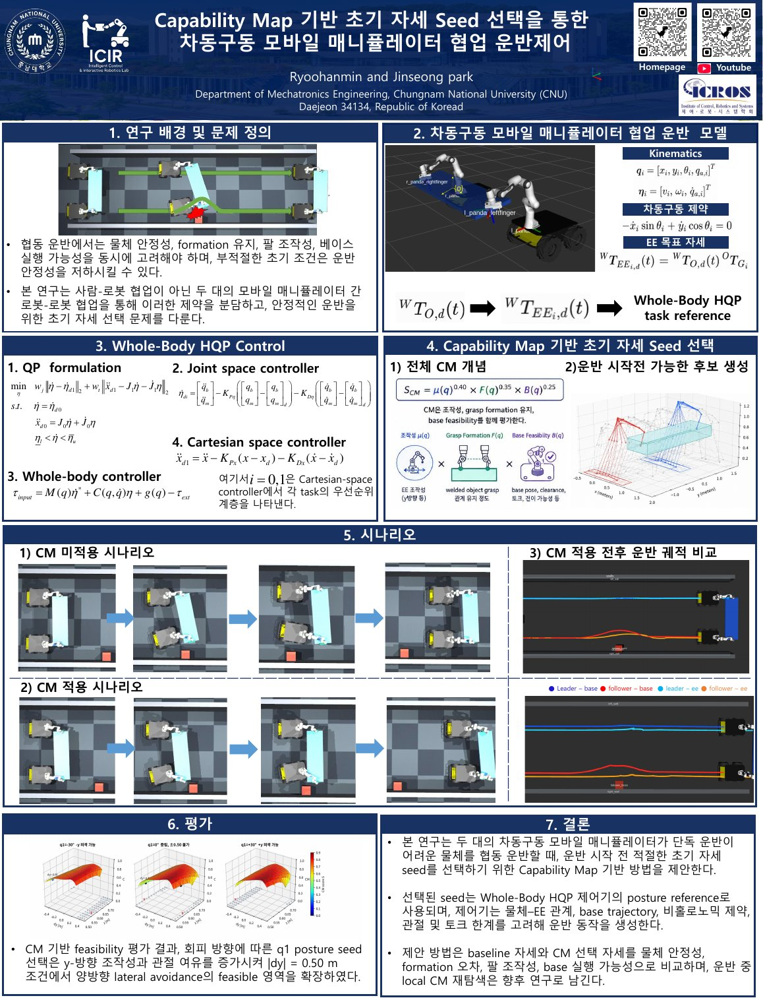
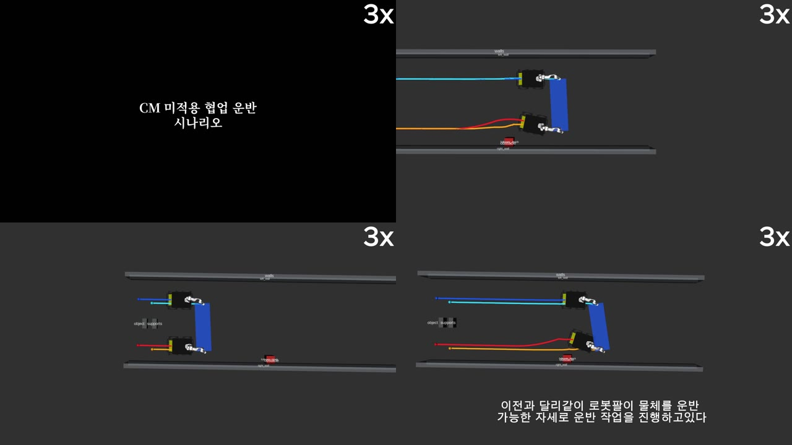

# Capabiliy Map 기반 초기 자세 선택을 활용한 차동구동 모바일 매니퓰레이터의 협업 운반

[English](README.md) · **한국어**

**운반을 시작하기 전에 Capability Map으로 팔의 초기 자세를 고르면, 두 대의 차동구동 모바일 매니퓰레이터가 좋은 자세를 무너뜨리지 않고 물체를 함께 옮길 수 있다.**

2026 ICROS 학부연구생 연구 프로젝트 · 충남대학교 메카트로닉스공학과 · [iCIR Lab](https://sites.google.com/view/icir-lab/)

두 대의 Husky-Panda 모바일 매니퓰레이터가 하나의 물체를 협업 운반하는 ROS1/MuJoCo 시뮬레이션입니다. 운반 시작 전 **Capability Map(CM)** 으로 선택한 팔 자세와 일반 home 자세를 같은 운반 조건에서 비교하며, 각 로봇의 Whole-Body HQP 명령을 하나의 26축 MuJoCo command로 병합합니다.

---

## 발표 자료와 전체 시나리오

| 자료 | 내용 |
|---|---|
| [학부연구생 포스터 PDF](assets/poster/학부연구생포스터_유한민.pdf) | 연구 배경, Whole-Body HQP, CM seed 선정 및 평가 |
| [전체 시나리오 영상](assets/video/2026ICROS_학부연구생_유한민.mp4) | Home baseline과 CM 적용 협업 운반 비교 |

[](assets/poster/학부연구생포스터_유한민.pdf)

[](https://www.youtube.com/watch?v=ukqPhyuMfp4)

---

## 시스템 개요

```text
┌─────────────────────────────────────────────────────────────────────────┐
│                          /coop_phri_simul                               │
│        weld attach · object target · lift readiness · TF/metric         │
│        CM runtime (q_sym) · 13+13 → 26축 command 병합                   │
│                    ▲                            │                       │
│         상태 분할  │                            │  26축 joint command   │
│                    │                            ▼                       │
│   ┌────────────────┴─────────────────┐   /coop_scene/mujoco_ros         │
│   │                                  │   (통합 MuJoCo 상태)             │
│   ▼                                  ▼                                  │
│ /leader_hqp_controller      /follower_hqp_controller                    │
│   13축 command                13축 command                              │
│   (Whole-Body HQP)            (Whole-Body HQP)                          │
│           ▲                          ▲                                  │
│           └────────── posture reference q_sym ──────────┐               │
│                                                         │               │
│                       config/holding_cm_seed_lateral_nullspace.yaml     │
│                                (offline CM seed)                        │
└─────────────────────────────────────────────────────────────────────────┘
```

### 주요 특징

- **Whole-Body HQP 제어** — 차동구동(비홀로노믹) Husky base 위의 7-DoF Panda 팔을 로봇당 하나의 계층적 QP로 통합 제어합니다.
- **리더-팔로워 협업 운반** — 두 EE가 물체에 강체로 결합되며, 팔을 변형해 쫓아가지 않고 base를 움직여 대형을 유지합니다.
- **Offline Capability Map seed** — 운반 시작 자세를 조작성, grasp formation, base feasibility로 사전에 선택합니다.
- **동일 조건 A/B 비교** — CM seed와 home 자세를 같은 물체, weld 강성, 센서, 0.10 m lift, mode 235 경로 조건에서 비교합니다.
- **단일 통합 시뮬레이션** — 하나의 MuJoCo 상태를 로봇별로 분할하고, 두 개의 13축 명령을 약 500 Hz로 26축 command에 병합합니다.

---

## 구성

```text
src/kimm_phri_panda_husky/
├── CMakeLists.txt
├── package.xml
├── launch/
│   ├── cm_transport.launch        # CM 시나리오 (baseline launch도 이 파일을 포함)
│   └── home_transport.launch      # home baseline, CM 관련 인자만 재정의
├── config/
│   └── holding_cm_seed_lateral_nullspace.yaml   # 초기 상태 + 선택된 offline CM seed
├── include/kimm_phri_panda_husky/
│   └── panda_husky_hqp.h
└── src/
    ├── coop_husky_hqp_node.cpp    # 상태 분할, reference/Fext 입력, 로봇별 13축 명령
    ├── coop_phri_simul.cpp        # weld 시험, object target, 키 입력, CM runtime, command 병합
    └── panda_husky_hqp.cpp        # posture 및 협업 운반 Whole-Body HQP
```

| 파일 | 역할 |
|---|---|
| `launch/cm_transport.launch` | MuJoCo와 leader/follower HQP 노드를 실행하는 기본 CM 시나리오 |
| `launch/home_transport.launch` | CM launch를 재사용하는 home baseline 시나리오 |
| `config/holding_cm_seed_lateral_nullspace.yaml` | 초기 상태, 선택된 offline CM seed와 평가 지표 |
| `src/coop_phri_simul.cpp` | weld 시험, object target, lift readiness, 키 입력과 26축 command 병합 |
| `src/coop_husky_hqp_node.cpp` | 통합 상태 분할, reference/Fext 입력과 로봇별 13축 명령 발행 |
| `src/panda_husky_hqp.cpp` | posture 및 협업 운반 Whole-Body HQP 제어 |

실행되는 노드는 다음 네 개입니다.

```text
/coop_scene/mujoco_ros
/coop_phri_simul
/leader_hqp_controller
/follower_hqp_controller
```

---

## 1. 실행 환경

시뮬레이션 전용이며, 실제 로봇 하드웨어는 필요하지 않고 이 저장소에서 다루지도 않습니다.

| 항목 | 버전 / 설치 |
|---|---|
| OS | Ubuntu 20.04 |
| ROS | Noetic |
| Eigen3 | `sudo apt install libeigen3-dev` |
| yaml-cpp | `sudo apt install libyaml-cpp-dev` |
| Pinocchio | `/opt/openrobots` 설치 ([공식 가이드](https://stack-of-tasks.github.io/pinocchio/download.html)) |

이 저장소는 핵심 시나리오 패키지만 제공하므로, 다음 패키지가 같은 catkin workspace에 준비되어 있어야 합니다.

| 패키지 | 제공 기능 |
|---|---|
| `kimm_hqp_controller` | 계층적 QP whole-body 제어기 |
| `mujoco_ros`, `mujoco_ros_msgs` | MuJoCo-ROS 브릿지와 메시지 |
| `husky_description` | 로봇 모델과 협업 운반 scene |

`husky_description`에 다음 파일이 있어야 합니다.

```text
husky_coop/coop_transport_scene_straight_clean_generated.xml       # CM scene
husky_coop/coop_transport_scene_straight_clean_home_baseline.xml   # home baseline scene
husky_single/husky_panda_hand.urdf
```

---

## 2. 빌드

```bash
cd <catkin_workspace>
source /opt/ros/noetic/setup.bash
catkin_make
source devel/setup.bash
```

실행 전에 두 launch 파일이 정상적으로 해석되는지 확인합니다.

```bash
roslaunch kimm_phri_panda_husky cm_transport.launch   --nodes
roslaunch kimm_phri_panda_husky home_transport.launch --nodes
```

library, header, `coop_husky_hqp_node`, `coop_phri_simul`, launch/config install 규칙을 포함하므로 install space에서도 동작합니다.

---

## 3. 비교 시나리오

두 시나리오 모두 **체결 → lift → 운반** 세 단계의 키 입력으로 진행합니다.
시뮬레이션은 `c` 입력 전까지 일시정지 상태이므로, 깨끗한 grasp-ready 자세에서 weld가 체결됩니다.

### 3.1 CM 초기 자세 적용

`holding_cm_seed_lateral_nullspace.yaml`의 `selected/q_sym`을 mode 238에서 양팔 posture reference로 적용합니다.

```bash
roslaunch kimm_phri_panda_husky cm_transport.launch
```

| 키 | 동작 |
|:---:|---|
| `c` | simulation-only weld attach |
| `y` | CM posture 적용 및 0.10 m lift (mode 238) |
| `0` | 협업 운반 시작 (mode 235) |

### 3.2 CM 미적용 Home Baseline

CM seed를 발행하지 않고 일반 home posture를 유지한 상태에서 같은 lift와 운반 경로를 수행합니다. `home_transport.launch`는 `cm_transport.launch`를 포함하고 baseline에 필요한 인자만 재정의합니다.

```bash
roslaunch kimm_phri_panda_husky home_transport.launch
```

| 키 | 동작 |
|:---:|---|
| `c` | simulation-only weld attach |
| `t` | home posture 유지 및 0.10 m lift (mode 211) |
| `0` | 협업 운반 시작 (mode 235) |

> 두 시나리오는 물체 크기, weld 강성, 센서, 0.10 m lift와 mode 235 경로 조건이 같습니다. 다만 CM `q_sym`과 원본 home은 실제 그리퍼 중심의 최종 높이가 서로 달라, 각 자세에 맞는 물체·지지대 높이를 사용합니다.

---

## 4. Control Mode

| Mode | 담당 | 의미 |
|---:|---|---|
| `1` | HQP | home / posture 유지 |
| `21` | orchestration | simulation weld attach 시험 |
| `200` | HQP | 외부 EE/base/posture reference 추종 |
| `211` | orchestration | CM 미적용 home baseline lift |
| `238` | orchestration | CM posture 적용 lift |
| `235` | HQP | 최종 협업 운반 |

mode 238의 lift-ready는 10 cm lift 목표의 1 cm 이내에서만 열립니다. grasp metric이 0.5초 이상 끊기거나 tolerance 밖으로 다시 벗어나면 ready를 false로 되돌려 mode 235 신규 진입을 막습니다.

---

## 5. Capability Map Seed

초기 자세 후보는 팔 조작성 $\mu(q)$, grasp formation $F(q)$, base feasibility $B(q)$를 가중 기하평균으로 함께 평가합니다.

$$
S_{CM}=\mu(q)^{0.40}\times F(q)^{0.35}\times B(q)^{0.25}
$$

가장 높은 점수의 후보를 `config/holding_cm_seed_lateral_nullspace.yaml`의 `selected/q_sym`에 저장하고, 운반 시작 시점에 한 번 적용합니다.

**여기서 CM은 offline seed이며 online planner가 아닙니다.** 운반 중에 CM을 반복 탐색하지 않고, 사전에 선택한 자세를 가능한 한 유지합니다. 장애물 회피 방향과 yaw 정렬은 mode 235의 base trajectory 및 HQP mobile task가 담당합니다.

---

## 6. 설정

### 6.1 Launch 인자

| 인자 | 기본값 | 설명 |
|---|---|---|
| `model_file` | `husky_coop/coop_transport_scene_straight_clean_generated.xml` | MuJoCo scene |
| `cm_seed_file` | `config/holding_cm_seed_lateral_nullspace.yaml` | offline CM seed |
| `apply_cm_posture` | `true` | `q_sym`을 posture reference로 발행 |
| `apply_cm_base` | `false` | CM base pose 적용 (현재 시나리오에서는 미사용) |
| `publish_lift_home_posture` | `false` | lift 중 home posture 발행 (baseline 경로) |
| `initial_ctrl_mode` | `200` | 기동 시 진입 제어 모드 |
| `hqp_rate` | `500.0` | HQP 연산 및 명령 발행 주기 [Hz] |
| `start_keyboard` | `true` | 키보드 인터페이스 실행 |
| `attach_request_delay` | `1.0` | attach 요청 지연 [s] |

### 6.2 Weld 체결 조건

`c` 키의 weld attach는 MuJoCo 시뮬레이션 시험용 파지입니다.

초록색 `l_ee_grasp_site` / `r_ee_grasp_site`가 실제 시뮬레이션 파지 기준입니다. controller FK와 MuJoCo 모델 사이의 base 높이·frame 차이를 추정값으로 처리하지 않고, scene의 `framepos` / `framequat` 센서가 발행하는 실제 site pose를 EE target 보정과 진단에 사용합니다. weld `relpose`도 이 site와 물체 양 끝 파지 frame 사이의 비관통 자세에서 생성합니다.

초기 weld 시 양쪽 base는 nominal seed보다 각각 5 mm 바깥쪽에 두어 총 10 mm의 측면 여유를 확보합니다. 관통은 EE/link7/elbow가 실제 object box 체적 안에 있는 경우만 판정하며 체결 시점에 반드시 0이어야 합니다. mode 235 운반 중에는 관통 진단을 기록하되 진입 실패 조건으로 사용하지 않습니다.

---

## 7. 시뮬레이션 검증

두 시나리오(`c → y → 0`, `c → t → 0`) 모두에서 확인한 결과입니다.

- 체결 시점 EE/link7/elbow 관통 0
- lift 약 `+0.10 m`
- mode 235 phase 0~5 완료, 양쪽 13축 command 약 500 Hz 발행, NaN/Inf 없음

---

## 8. 현재 범위와 한계

- **시뮬레이션 전용입니다.** `c` 키의 weld attach는 MuJoCo 시험 경로이며 실제 gripper command를 대체하지 않고, 실로봇 bring-up은 이 저장소에 포함되지 않습니다.
- **CM은 offline 초기 seed입니다.** 운반 중 local CM 재탐색은 포함하지 않습니다.
- **외력(Fext) 보상은 사용하지 않았습니다.** 관련 코드와 launch 인자(`fext_*`)가 있으나 두 비교 시나리오 모두 기본값 `false`로 비활성이며, 동작은 검증되지 않았습니다.
- **두 scene의 world 높이는 동일하지 않습니다.** CM `q_sym`과 원본 home이 도달하는 실제 그리퍼 높이가 달라 각 scene이 자체 물체·지지대 높이를 사용합니다. world 높이까지 맞추는 CM seed 재계산은 제어 조건 자체가 달라지므로 향후 과제로 둡니다.

---

## 9. 문제 해결

**물체가 지지대에서 미끄러지고 weld가 거부됩니다**
- 시뮬레이션은 `c` 입력 전까지 의도적으로 일시정지 상태입니다. 체결 전에 시뮬레이션을 먼저 돌리면 갭이 커져 weld가 거부됩니다.

**`catkin_make`가 `kimm_hqp_controller` 또는 Pinocchio를 찾지 못합니다**
- `kimm_hqp_controller`가 같은 workspace에 있는지, Pinocchio가 `/opt/openrobots`에 설치되어 있는지 확인합니다.

**MuJoCo가 scene을 로드하지 못합니다**
- `model_file` 경로가 `husky_description` 안에서 해석되는지 확인합니다 (CM은 `husky_coop/…_generated.xml`, baseline은 `…_home_baseline.xml`).

**노드가 기동하지 않습니다**
- 먼저 `--nodes`로 노드 그래프가 해석되는지 확인한 뒤, `rosnode list`로 네 개 노드가 모두 있는지 검사합니다.

---

## 인용

```bibtex
@inproceedings{ryoo2026capability,
  title     = {Capability Map 기반 초기 자세 선택을 활용한
               차동구동 모바일 매니퓰레이터의 협업 운반},
  author    = {유한민 and 박진성},
  booktitle = {제어로봇시스템학회 학술대회 논문집 (ICROS 2026)},
  year      = {2026}
}
```

## Authors

- **유한민** — 충남대학교 메카트로닉스공학과
- **박진성** — 충남대학교 메카트로닉스공학과 / iCIR Lab

## License

MIT License. 자세한 내용은 [LICENSE](LICENSE)를 참고하십시오.
